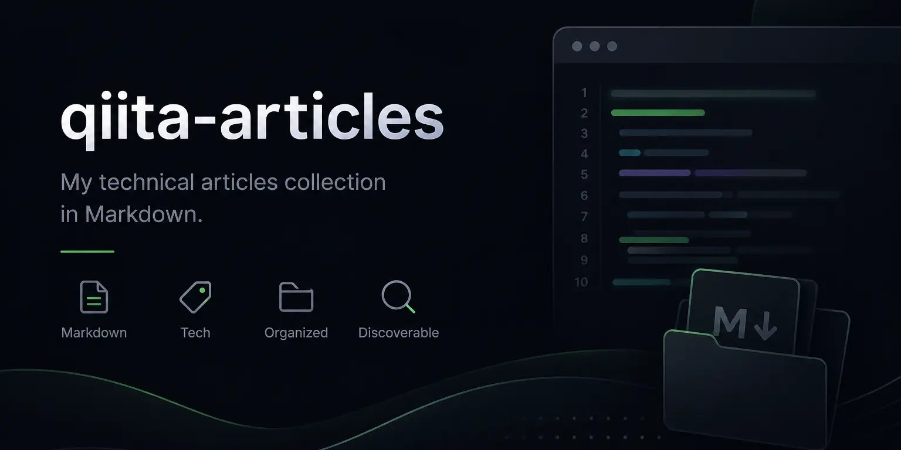

# Qiita記事リポジトリ

[Qiita](https://qiita.com/hidao80) に投稿した記事を管理するリポジトリです。

## 記事カテゴリ

| カテゴリ | 主なトピック |
|---|---|
| AI / LLM | Claude Code・MCP・Ollama・ローカルLLM・Recline |
| PHP / Laravel | 静的解析（mago・PHPStan・Larastan）・Composer・Xdebug・git hooks |
| Git | Jujutsu (jj)・SSH 接続・safe.directory・トンネリング |
| VS Code | 拡張機能開発・Drag & Drop API・AsciiDoc・Polacode |
| Docker / 仮想化 | WSL2・Docker Desktop なし構成・Vagrant・Cloud9・Nextcloud |
| JavaScript | Chrome 拡張・PWA・Vanilla JS・Azure Face API・顔検出 |
| Windows | winget・chocolatey・PowerShell スクリプト・npm 設定 |
| Mac / Linux | Homebrew・Bluetooth トラブル・コマンドワンライナー |
| Markdown / 文書 | Marp・AsciiDoc PDF・高橋メソッドスライド |
| その他 | SNS シェアURL・ブックマークレット・Hugo shortcode |

## リポジトリ構成

```
articles/   # Markdown形式の記事ファイル（ファイル名 = Qiita の記事ID）
img/        # 画像ファイルを保管し、リンク先とします
```

## ライセンス

各記事の著作権はhidaoに帰属します。
